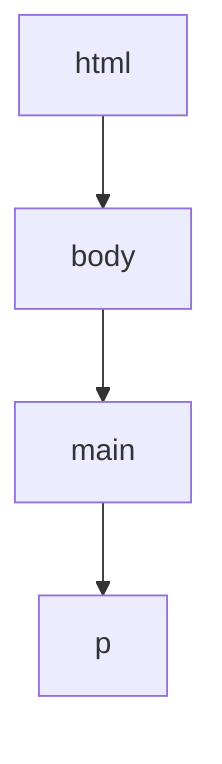

# 17.06.2022

## A16 CSS (Cascading Style Sheets)
CSS (Cascading Style Sheets) ist eine Möglichkeit, um eine Website gestalterisch zu gestallten. Der Name Cascading Style Sheets kommt von der Art, wie CSS Funktioniert.
Cascading zu deutsch Kaskadierung bedeutet so viel wie voneinander abhängig/verkettung. Beim CSS erben alle Child Elemente von ihrnen Parent Elementen.  Dabei werden z.B. 
alle Styles, welche auf das html Element angewendet werden auch autmatisch auf den body angewendet. Falls man dies nicht möchte kann man die Styles natürlich auch wieder
im child Element überschreiben.

## A18: Selektoren und Pseudo-Selektoren
### Selektoren
Es gibt 3 verschiedene Arten von Selektoren
- **Element-Selektor**
Wählt ein eintzelnes Element aus. Dabei gilt diese CSS Regel für alle Elemente von dem besagten Element (z.B. alle Paragraphen)
- **Klass Selektoren**
Man kann natürlich auch nach Klassen Selektieren. Dies kann man sehr einfach mit `.MyCustomClassName` machen.
- **ID Selektor**
