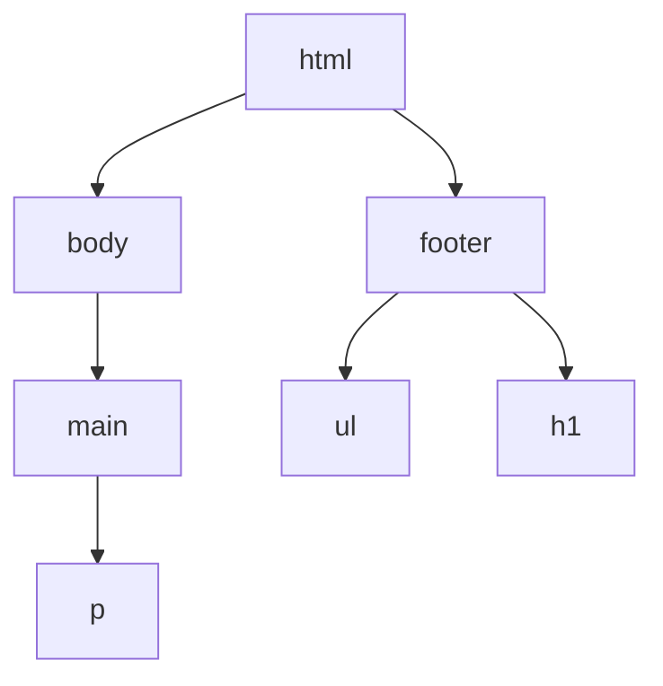

[Back to Main Page](./../README.md)

# 17.06.2022

## A16 CSS (Cascading Style Sheets)
CSS (Cascading Style Sheets) ist eine Möglichkeit, um eine Website gestalterisch zu gestallten. Der Name Cascading Style Sheets kommt von der Art, wie CSS Funktioniert.
Cascading zu deutsch Kaskadierung bedeutet so viel wie voneinander abhängig/verkettung. Beim CSS erben alle Child Elemente von ihrnen Parent Elementen.  Dabei werden z.B. 
alle Styles, welche auf das html Element angewendet werden auch autmatisch auf den body angewendet. Falls man dies nicht möchte kann man die Styles natürlich auch wieder
im child Element überschreiben.

## A18: Selektoren und Pseudo-Selektoren
### Selektoren
Es gibt 3 verschiedene Arten von Selektoren. Mit ihnen kann man bestimmen, auf welche Elemente alles gewisse CSS Regeln angewant werden.
- **Element-Selektor** 
Wählt ein eintzelnes Element aus. Dabei gilt diese CSS Regel für alle Elemente von dem besagten Element (z.B. alle Paragraphen)
- **Klass Selektoren**  
Man kann natürlich auch nach Klassen Selektieren. Dies kann man sehr einfach mit `.MyCustomClassName` machen.
- **ID Selektor**  
Wenn man es möchte kann man auch auf einzelne Id's Filtern. Da ID (Unique Identifier) nur 1 mal pro HTML Verwendet werden können ist es relativ selten, dass man auf diese Filtert. Viel häuffiger verwendet man dafür Klassen

### Pseudo-Selektoren
Durch Pseude Selektoren kann man Selektoren genauer beschreiben. Pseude Selektoren können nie aleine stehen. Z. B. wenn man gewisse CSS Regeln nur anwenden möchte wenn der Mauszeiger über das besagte Ellement Hovert kann man dies z.B. mit `<element>:hover` anwenden. Am Häufigsten kommen Pseudo Selektoren bei Links zum Einsatz.

## A19 Inline und Blockelemente
Der Unterschied zwischen Block und Inlineelementen ist recht einfach. Block Elemente können nur als ein Block stehen. Das heist vereinfacht gesagt, dass immer nach einem Block element ein Zeilenumbruch folgt. Ein gutes Beispiel für ein Block Element ist z.B. ein Header `<h1>-<h6>`. Inline Elemente sind Elemente, welche zusammen mit anderen Elementen in einem Text stehen können. Ein Beispiel dafür währe z.B. ein Link (`<a>`) oder auch fetter Text (`<b>`)

## Reflexion
Ich denke, dass ich in dieser Woche gut vorangekommen bin. Ich konnte mit dem letzen (diesem) Lernjournal alle Kompetenzen abdeken. Bei den B-Kompetenzen fehlen mir auch nur noch 3 Stück, welche ich Problemlos das nächste Mal kurz vorstellen kann. Auch bin ich beim Abschluss Projekt sehr gut weitergekommen. Ich konnte in der Woche bereits eine kleine test Implementation von einem Algorythmus um Private -> Public Keys umzurechnen in Python zum Test Implementieren 
[secp256k1 ](https://github.com/Yanni8/secp256k1). Auch die CSS Strunktur meiner Website ist schon fast fertig und ein PHP Kontakt Formular ist auch bereit Implementiert. In der Nächsten Woche muss ich nur noch den Kontent fertig Implementieren. Das bedeutet etwas Text + ein YT Video für C11 und allenfalls Bilder.   
